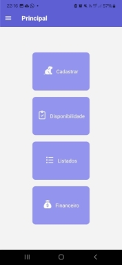

# Projeto-mobile

<p align="center">
  <a href="#funcionalidades-importantes">Funcionalidades Importantes</a> •
  <a href="#como-usar">Como Usar</a> •
  <a href="#estrutura-do-projeto">Estrutura do Projeto</a> •
  <a href="#créditos">Créditos</a> •
</p>

## Funcionalidades Importantes

* Administrar um Hotel de Cachorros
  - Adicionar cachorros e seus donos e listá-los de forma fácil e organizada.
* Leve para onde quiser
  - Como um aplicativo móvel, você pode administrar seu hotel de onde estiver.
* Fácil de usar
  - Interface simples e intuitiva, para que você possa focar no que realmente importa.

## Como usar?

Para começar, você precisa clonar o repositório usando [git](https://git-scm.com/) e instalar as dependências através do [npm](https://nodejs.org/en/download/package-manager):

```bash
# Clone o Repositório
$ git clone https://github.com/leosfreitass/Projeto-mobile.git

# Entre no Repositório
$ cd Projeto-mobile
```
O projeto se divide em duas partes principais, estando o backend localizado na pasta `backend` e o frontend na pasta `frontend`.

### Estrutura do Projeto

```
├── backend               # Root do backend
│   ├── prisma            # Configurações do Prisma
│   │   ├── data          # Localização do arquivo do banco de Dados
│   │   └── migrations    # Migrações geradas pelo Prisma
│   ├── src               # Código fonte do backend
│   │   ├── compartments  # Funcionalidades relacionadas às baias
│   │   ├── dogs          # Funcionalidades relacionadas aos cachorros
│   │   ├── owners        # Funcionalidades relacionadas aos donos
│   │   └── prisma        # Configurações do Prisma relacionadas ao NestJS
│   └── test              # Arquivos de Teste
└── frontend              # Root do frontend
    ├── assets            # Imagens e outros arquivos estáticos
    ├── configs           # Configurações do projeto
    └── src               # Código fonte do frontend
        ├── components    # Componentes reutilizáveis
        ├── screens       # Telas do aplicativo
        └── types         # Declaração de tipos Úteis
```

### Rodando o backend

Para iniciar o servidor da API, é necessário rodar os seguintes comandos:

```bash
# Entre no diretório do backend
$ cd backend

# Instale as dependências
$ npm install

# Inicie o servidor
# O servidor será iniciado na porta 3000
# Acesse http://localhost:3000/api para ver a API
$ npm start
```

### Rodando o frontend
```bash
# Entre no diretório do frontend
$ cd frontend

# Instale as dependências
$ npm install

# Inicie o aplicativo
# O aplicativo será iniciado no Expo
# Acesse http://localhost:8081 para ver o Aplicativo em Execução
# Ou escaneie o QR Code com o aplicativo Expo Go para rodar no seu dispositivo
$ npm start
```

## Créditos

Este aplicativo foi desenvolvido com as seguintes tecnologias:

### Backend

- [Node.js](https://nodejs.org/)
- [TypeScript](https://www.typescriptlang.org/)
- [NestJS](https://nestjs.com/)
- [Fastify](https://fastify.dev/)
- [Prisma](https://www.prisma.io/)

### Frontend

- [React Native](https://reactnative.dev/)
- [Expo](https://expo.dev/)
- [React Navigation](https://reactnavigation.org/)
- [Axios](https://axios-http.com/)

## Screenshots

| Tela | Screenshot |
| --- | --- |
| Principal |  |
